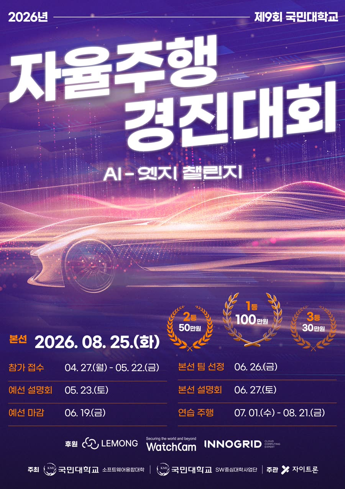
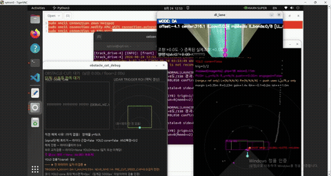
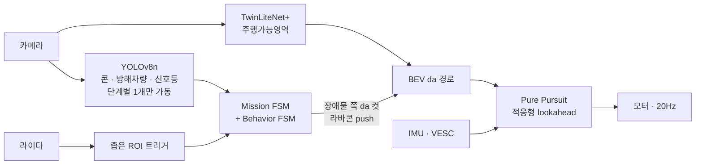

<div align="center">

# 국민대 자율주행 경진대회 2026




## **1/10 스케일 자율주행차로 미션 트랙 3바퀴를 도는 대회에 출전한 기록**
제9회 국민대학교 자율주행 경진대회 본선 · 2026.07 – 08 · 팀 KURiver



</div>

## 개요

| | |
|---|---|
| 과제 | 4구 신호등 판단, 라바콘 지그재그, 고정장애물 회피, 방해차량 추월, 지름길 분기를 포함한 트랙 3바퀴 |
| 차량 | 자이카 Y모델 + Jetson Orin NX 16GB, 170° 카메라, 2D 라이다, IMU, VESC |
| 스택 | ROS2 Humble · TwinLiteNet+ · YOLOv8n · ONNX Runtime / TensorRT · Pure Pursuit · Optuna |
| 결과 | 본선 출전, 완주 |
| 내 역할 | 판단 구조 설계, **조향 제어 튜닝**, 장애물·라바콘 회피, YOLO 거리 게이트, 세그멘테이션 데이터셋, **Jetson·TensorRT 최적화** |

## 내 파트

### 1. 판단 구조 설계: 이중 상태머신 → [docs/02](docs/02-system-architecture.md)

미션 진행을 두 층으로 나누는 구조를 구상했습니다.

- **Mission FSM**: 신호등과 차선 주행을 담당합니다.
- **Behavior FSM**: 차선 주행 중에 B0 일반 → B1 라바콘 → B2 고정장애물 → B3 방해차량 순서로 진행합니다.

라이다로는 B2와 B3가 비슷하게 보입니다. 그래서 트랙 순서를 이용해, B2 통과 후 3초 동안은 무엇이 잡혀도 B2로
처리하도록 했습니다. 매 바퀴 신호를 확정하는 순간 B1~B3를 다시 무장시키는 흐름도 이 구조 위에서 동작합니다.

### 2. 조향 제어 튜닝 → [docs/04](docs/04-steering-control.md)

Pure Pursuit 하나로 직진, S자, 90도 코너, 라바콘, 장애물 회피를 모두 처리해야 했고, 맞춰야 할 파라미터가
30개에 가까웠습니다.

- 실제 제어 코드를 그대로 불러 가상 차량을 모는 **튜닝 시뮬레이터**를 확장했습니다. 대회 도면으로 만든 실전
  트랙, Optuna 탐색(25개 파라미터), 속도별 프리셋 7종을 붙였습니다.
- 시뮬레이터 최적값을 실차에 올리자 **배터리 트립, 무감속 이탈, 좌우 진동**이 생겼고, 원인을 하나씩
  분리했습니다. 진동은 서보 지연을 모르는 시뮬레이터가 고른 **과도한 조향 게인** 때문이었습니다.
- 속도 환산값을 줄자 실측 회귀로 다시 쟀습니다(0.1347 → 0.0848 m/s).
- 최종값은 시뮬레이터 결과를 출발점으로 실차에서 직접 맞췄습니다. 순항 속도 12, 코너 하한 10에서
  직진·S자·코너를 모두 안정화했습니다.

### 3. 장애물 회피: da 근접 컷 → [docs/05](docs/05-missions.md)

라이다와 YOLO가 동시에 장애물을 잡으면, 장애물 쪽 주행가능영역(da)을 잘라 차선 주행이 알아서 피하게 하는
방식입니다. 이 컷이 **언제, 얼마나 크게, 얼마나 오래** 걸릴지를 맞췄습니다.

| 항목 | B2 고정장애물 | B3 방해차량 |
|---|---|---|
| 발동 거리 (전방) | 1.0m | 2.5m |
| 발동 폭 (좌우) | 0.55m | 0.75m |
| 컷 폭 | 차선폭의 90% | 차선폭 그대로 |
| 최소 유지 시간 | 0.2초 | 2.0초 |

- **해제는 늦게** 하도록 했습니다. 카메라가 차 앞코에 있어서 장애물이 시야에서 사라져도 차체는 아직 옆에
  있기 때문입니다. 그래서 4프레임 연속으로 비어 있어야 해제됩니다.
- 장애물 근처에서는 미리 속도를 8로 제한하고, 컷 진입 순간 1초간 조향 반응을 높였습니다.

### 4. 라바콘 구간 → [docs/05](docs/05-missions.md)

- **진입 킥**: 진입이 확정되는 순간 −30° 조향을 0.4초 걸어 첫 콘을 확실히 비켜 들어가도록 했습니다.
- **비례 밀기**: 기본은 차선 주행입니다. 라이다로 본 콘이 안전마진(좌 0.35m / 우 0.23m) 안으로 들어오면,
  들어온 만큼 경로를 반대쪽으로 밀도록 했습니다(게인 1.35).
- 라바콘 구간 전용 속도 상한(8)과 전용 조향 파라미터를 분리했습니다.

### 5. YOLO 거리 게이트 → [docs/03](docs/03-perception.md)

YOLO가 멀리 있는 물체에 너무 일찍 반응하면 컷이나 진입이 엉뚱한 곳에서 발동합니다. 그래서 박스 크기를
거리 대신 쓰는 게이트를 만들고, 기존 라이다 조건과 **AND**로 묶었습니다.

| 대상 | 박스 면적 하한 (640 입력 기준) |
|---|---|
| B1 라바콘 진입 | 5,000px² |
| B2 고정장애물 | 2,500px² |
| B3 방해차량 | 4,500px² |
| 신호등 | 1,500px² |

- 미션마다 전용 측정 창을 띄워, 발동해야 할 거리에서 박스 크기를 실제로 재서 정했습니다.
- 한 프레임 오검출에 반응하지 않도록 5프레임 연속 확인을 추가했습니다.

### 6. 세그멘테이션 데이터셋 → [docs/03](docs/03-perception.md)

TwinLiteNet+ 파인튜닝용 데이터를 모으고 만들었습니다.

- **수집**: ROS2로 수동 주행 중 카메라와 IMU를 기록하는 수집기(`manual_drive_collector.py`)를 썼습니다.
- **라벨 생성**: YOLOPv2로 초안 마스크를 만들고 SAM2로 다듬는 반자동 파이프라인입니다. 사람이 Gradio
  화면에서 채택/기각하고 CVAT로 내보냅니다.
- **결과**: 최종 v1.2.0 모델은 3,446장으로 학습해 주행가능영역 IoU 0.957이 나왔습니다.

### 7. Jetson 이식과 TensorRT → [docs/06](docs/06-tensorrt-deployment.md)

기본 차량의 Ryzen CPU로는 차선 세그멘테이션이 **10.8fps**에 그쳐 20Hz 제어 루프를 따라가지 못했습니다.

- Jetson Orin NX에서 TwinLiteNet+를 **TensorRT FP16으로 약 18fps**, YOLO를 약 25fps로 올렸습니다.
- 이 과정에서 겪은 문제 세 가지를 정리했습니다.
  - NMS 레이어 때문에 TensorRT 빌드가 조용히 실패하고 456초 뒤에 폴백함
  - 엔진 캐시가 끝까지 생성되지 않음
  - ultralytics가 `nms` 옵션을 경고 없이 무시함
- 모델 네 개가 GPU를 나눠 쓰지 않도록, 미션 단계별로 필요한 YOLO 하나만 켜는 구조를 썼습니다.

## 시스템 한눈에



가장 많이 검증된 **"세그멘테이션 경로 + Pure Pursuit"** 위에 모든 미션을 얹는 구조입니다. 라바콘과 장애물에
전용 회피 경로(보로노이, Hybrid A*, 옆차선 기동)를 만들었다가, 결국 주행가능영역을 조금 고쳐 차선 주행이
알아서 피하게 하는 쪽으로 수렴했습니다. → [docs/02](docs/02-system-architecture.md), [docs/05](docs/05-missions.md)

## 시행착오 하이라이트

팀 설계 일지 3,713줄을 주제별로 다시 읽고 정리했습니다. → **[docs/10-lessons-learned.md](docs/10-lessons-learned.md)**

| | 무슨 일이 있었나 |
|---|---|
| 시뮬레이터는 지연을 모른다 | "더 정확한" 게인이 실차에서 진동을 만듦 |
| 조향 기준점 좌편향 24° | 녹화 2,734장을 오프라인 재생해 숫자로 확정 |
| 같은 경로를 두 곳에서 | 갱신 조건이 달라 회피 중 목표점이 순간이동, 벽 충돌 |
| 조용한 실패 | IMU 고장, TensorRT 폴백, 테스트 플래그로 40초간 속도 5 고정 — 모두 에러 로그 없음 |
| 단순한 쪽이 이겼다 | 라바콘 알고리즘을 하루 4번 바꾼 끝에 일반 차선 주행으로 통과 |
| 하드웨어는 소프트웨어로 못 덮는다 | 출발 끊김에 가설 두 개를 코드로 시도, 결국 배터리 쪽 |

## 문서

| 문서 | 내용 |
|---|---|
| [01 대회 개요](docs/01-competition.md) | 규정, 벌점, 트랙 치수 |
| [02 아키텍처](docs/02-system-architecture.md) | 노드 구성, 20Hz 루프, 상태머신 |
| [03 인지](docs/03-perception.md) | 고전 CV → 딥러닝, da 경로 생성, YOLO, 파인튜닝 |
| [04 조향 제어](docs/04-steering-control.md) | Pure Pursuit, 속도 계획, 튜닝 시뮬레이터 |
| [05 미션](docs/05-missions.md) | 신호등, 라바콘, 장애물, 지름길 |
| [06 TensorRT](docs/06-tensorrt-deployment.md) | Jetson 이식과 함정 |
| [07 하드웨어·환경](docs/07-hardware-and-dev-env.md) | 기동 체크리스트, 센서, 원격 접속 |
| [08 캘리브레이션](docs/08-calibration.md) | 실측값과 설계값 |
| [09 타임라인](docs/09-timeline.md) | 날짜별 진행 |
| [10 시행착오](docs/10-lessons-learned.md) | 설계 일지 재구성 |

다음 대회를 준비한다면 [docs/README.md](docs/README.md)의 읽는 순서를 참고하세요.

## 저장소 구성

```
├── docs/            설계·인수인계 문서 (+ archive/ 설계 일지 원문)
├── src/             본선 코드 스냅샷 (수정 없음, 실행 방법은 src/README.md)
│   ├── track_drive/   메인 ROS2 노드 — 인지·상태머신·제어
│   ├── yolo_ros/      YOLO 가중치
│   └── xycar_device/  IMU 드라이버
├── media/           주행 GIF, 대회 포스터
└── CREDITS.md       원본 저장소와 팀
```

## 크레딧

팀 KURiver가 함께 만든 코드입니다. 원본은 팀원의 저장소
[KURiver-KMU-auto-contest](https://github.com/mastic-choi/KURiver-KMU-auto-contest)이며, 이 저장소는
그 코드를 스냅샷으로 담고 문서를 새로 정리한 개인 기록입니다. 자세한 출처는 [CREDITS.md](CREDITS.md)에 있습니다.
