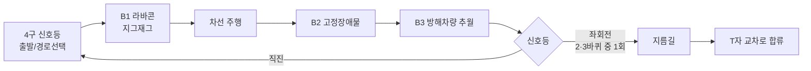

# 01. 대회 개요와 규정

> 출처: 대회 측 「2026년 9회 대회 경주진행방법」(2026-07-29 버전)을 팀이 요약한 내용을 다시 정리했습니다.
> 원문 공지가 대회 직전까지 바뀔 수 있다고 명시되어 있었으므로, 다음 대회에서는 반드시 최신 공지로 확인하세요.

## 한눈에

| 항목 | 내용 |
|---|---|
| 대회 | 제9회 국민대학교 자율주행 경진대회 (주최: 국민대 소프트웨어융합대학/SW중심대학사업단, 주관: 자이트론) |
| 본선 | 2026-08-25, 국민대 미래관 4층 자율주행스튜디오 |
| 차량 | 자이카(Xycar) Y모델, 1/10 스케일 RC카, ROS2 Humble |
| 과제 | 트랙을 **반시계 방향 3바퀴** 자율주행하며 구간별 미션 통과 |
| 순위 | `총 주행시간 = 순수 주행시간 + 벌초`, 오전·오후 2회 중 좋은 기록 |

## 한 바퀴의 흐름

- **차선**: 바깥쪽 흰 실선 사이 어디든 주행 가능. 노란 점선은 참고선일 뿐 1·2차선 구분이 없습니다.
  도로 전체 폭은 80cm(차선 하나 40cm)입니다.
- **방해차량**: 저속으로 1·2차선을 오갑니다. 차량이 **없는** 차선 쪽으로만 추월할 수 있고, 추월 중
  실선 이탈은 봐주지만 추월 후에는 빨리 복귀해야 합니다.
- **지름길**: 좌회전 신호는 2바퀴째 또는 3바퀴째 시작 시 랜덤으로 **딱 한 번** 나옵니다. 나머지는 직진.
- **완주 판정**: 심판이 결승선 통과를 판정합니다. 차량이 스스로 멈출 필요는 없습니다.

## 벌점과 실격

| 상황 | 조치 |
|---|---|
| 빨간불 출발 | 10초 + 재출발 (재위반 시 추가 10초 + 원위치) |
| 파란불 후 1분 내 미출발 | **실격** |
| 주행 중 정지 후 1분 내 미재개 | **실격** |
| 사람이 차량 터치 | 회당 5초 (바퀴당 15회/60초 초과 시 **실격**) |
| 라바콘 충돌 | 개당 3초 |
| 라바콘 구간 1분 내 미통과 | **실격** |
| 차선 이탈 | 이탈 위치로 옮겨 재주행 |
| 방해차량 추돌 (가해·피해 모두) | 각 10초 |
| 3바퀴 순수 주행시간 4분 초과 | **실격** |

이 규정에서 나온 설계상 결론은 두 가지였습니다.

1. **가점이 없고 시간과 벌초만 본다.** 미션을 "완벽히" 하려고 감속하는 것과 벌점 리스크를 감수하는 것을
   시간으로 비교할 수 있습니다.
2. **4분 제한이 있다.** 3바퀴 기준 바퀴당 80초 안쪽이어야 하므로, 확인하며 천천히 가는 보수적인
   상태머신은 오히려 실격 위험을 만듭니다.

## 트랙 치수 (도면 기준)

- 좌측 코너 2개: R 1,950mm
- 우측 지그재그 구간: R 1,615 / 1,530 / 1,595 / 1,470mm 4개 원호 (회전각은 도면에 없음)
- 이 치수는 조향 튜닝 시뮬레이터의 "실전 트랙" 시나리오에 그대로 들어갔습니다
  ([04-steering-control.md](04-steering-control.md)).
