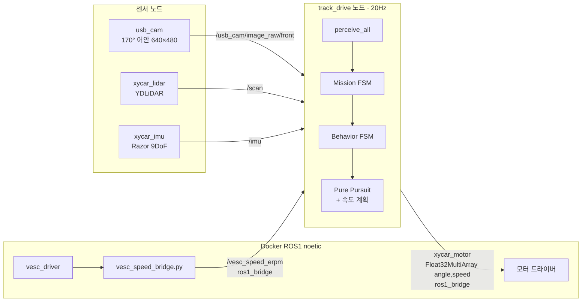
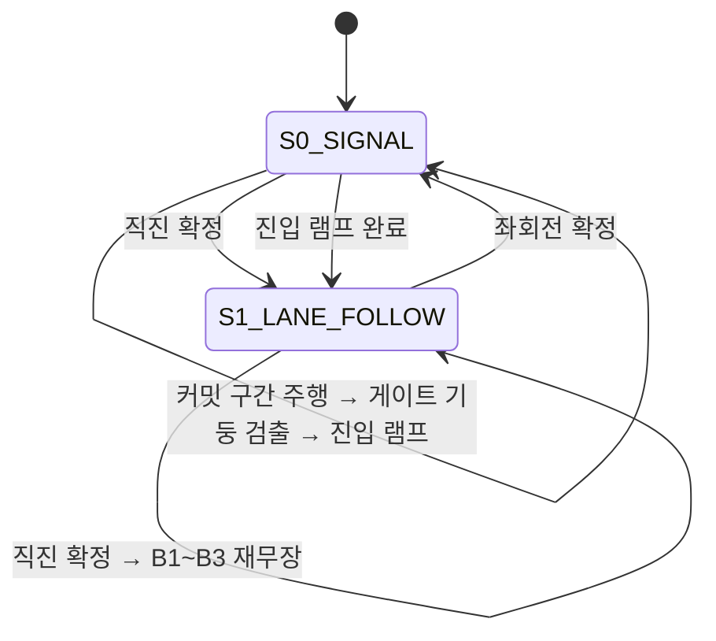
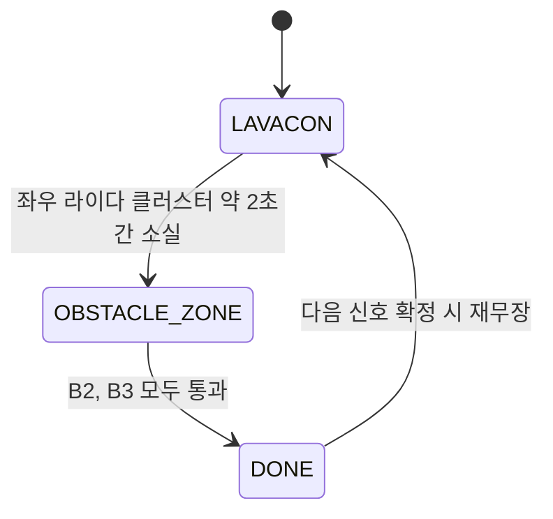

# 02. 시스템 아키텍처

## 전체 구조

센서 드라이버는 각자 별도 노드로 뜨고, **인지·판단·제어는 `track_drive` 노드 하나가 전부** 맡습니다.
YOLO도 처음엔 별도 ROS 노드였지만, 최종 버전에서는 `track_drive`가 ONNX 모델을 직접 불러 같은 프로세스
안에서 추론합니다.



- 모터 제어는 **ROS1 Docker 컨테이너 안**에서 돌아갑니다. ROS2 노드만 띄우면 차가 움직이지 않습니다.
- `xycar_motor`는 `Float32MultiArray([angle, speed])`로 보냅니다. 구형 `XycarMotor` 커스텀 메시지는
  `ros1_bridge`가 매핑하지 못하기 때문입니다.
- VESC 실측 속도도 ROS1 쪽에서 `Float32`로 바꿔 브릿지를 건너옵니다.

## 20Hz 제어 루프

`control_loop()`가 0.05초 타이머로 한 사이클을 돕니다.

```
perceive_all()          카메라·라이다·YOLO 결과 갱신 (무거운 추론은 백그라운드 스레드)
  → _update_lap()       IMU yaw 누적으로 바퀴 수 계산
  → run_mission_fsm()   신호등 / 차선주행
  → run_behavior_fsm()  S1 차선주행 중일 때만: 라바콘 → 장애물 구간 → 완료
  → apply_behavior_override()
  → drive(angle, speed) 조향 변화율 제한(12°/틱) 적용 후 발행
```

TwinLiteNet+와 YOLO 추론은 각각 **별도 스레드**에서 돌고, 제어 루프는 가장 최근 결과를 가져다 씁니다.
이 때문에 "추론이 느려서 이전 결과를 재사용 중"인지 "추론 스레드가 죽어서 안 갱신되는" 것인지 구분이
필요했고, 결과마다 시퀀스 번호와 타임스탬프를 붙여 확인합니다(→ [10-lessons-learned.md](10-lessons-learned.md#4-조용한-실패)).

## 이중 상태머신

### Mission FSM



| 상태 | 역할 |
|---|---|
| `S0_SIGNAL` | 4구 신호등 판단(출발선·교차로 공용). 좌회전이면 지름길 진입까지 담당 |
| `S1_LANE_FOLLOW` | 차선 주행. B1/B2/B3는 모두 이 상태 **안에서** 처리 |
| `S4_FINISH` | 코드에는 있지만 전이하지 않음. 완주는 심판이 판정 |

초기에는 `S0_WAIT_GREEN`, `S2_INTERSECTION`, `S3_SHORTCUT`이 따로 있었는데, 같은 신호등 모델을 쓰고
지름길도 "램프 한 번 + 차선 주행"으로 충분하다는 게 확인되면서 하나씩 합쳐졌습니다.

### Behavior FSM



| Phase | 진입 조건 | 실제 처리 |
|---|---|---|
| `LAVACON` (B1) | 라이다 좌우 클러스터 **AND** YOLO 콘 | da 차선 주행 + 진입 순간 고정 조향 킥 + 콘 침범 시 경로 밀기 |
| `OBSTACLE_ZONE` (B2/B3) | 라이다 **AND** YOLO | 별도 회피 상태 없이 "da 근접 컷"이 항상 켜진 채로 처리 |
| `DONE` | B2·B3 통과 | 일반 차선 주행 |

B2와 B3를 별도 Phase로 나눴다가 하나로 합친 이유, 근접 컷을 택한 이유는
[05-missions.md](05-missions.md)에 있습니다.

## 모델 단계별 가동

YOLO 3종(콘, 방해차량, 신호등)을 항상 같이 돌리면 Jetson GPU를 나눠 쓰게 됩니다. `_active_yolo_stage()`가
지금 상태에서 필요한 모델 **하나만** 켭니다.

| 상황 | 가동 모델 |
|---|---|
| 신호 대기, B3 통과 후 | 신호등 |
| 라바콘 진입 전 | 콘 (진입 확정 후에는 끔 — 콘이 시야를 가려 의미가 없음) |
| 장애물 구간 B2 | 콘 |
| 장애물 구간 B2 통과 3초 후 | 방해차량 |

차선 인식(TwinLiteNet+)은 상태와 무관하게 항상 돕니다.

## 설정은 `config.py` 하나로

튜닝값, 디버그 창 스위치, 시작 상태, 테스트용 플래그가 모두 `config.py` 한 파일(1,797줄)에 있고
모듈들은 `from .config import *`로 가져다 씁니다. 실차 앞에서 값 하나를 바꿀 때 여러 파일을 뒤질 필요가
없다는 게 가장 큰 장점이었습니다.

대신 `TEST_*`, `START_STATE` 같은 테스트 전용 플래그를 켜둔 채 잊으면 실제 레이스가 망가집니다. 실제로
설계 일지에 "★반드시 원복★" 표시가 붙은 항목이 여러 번 나옵니다. 다음 팀이라면 **레이스 모드 체크
스크립트**(테스트 플래그가 전부 꺼져 있는지 기동 시 검사)를 두는 걸 권합니다.
