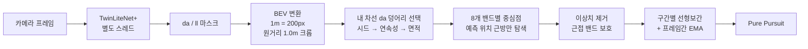

# 03. 인지

## 최종 구성

| 대상 | 방식 | 모델 / 근거 |
|---|---|---|
| 주행가능영역(da), 차선(ll) | TwinLiteNet+ 듀얼헤드 세그멘테이션 | 자체 파인튜닝 v1.2.0 (3,446장) |
| 라바콘 | YOLOv8n | `cone_best_n.onnx` |
| 방해차량 | YOLOv8n, 대회 차량 뒷모습 전용 1클래스 | `target_vehicle` v1.2.0 |
| 신호등 | YOLOv8n, 보드 위치 + 색상 상태 동시 예측 | `signal_state` v1.2.0 (`red`/`green_straight`/`green_left`) |
| 라바콘 진입·게이트·장애물 트리거 | 2D 라이다, 좁은 ROI + 카메라 이중확인 | 별도 검출기 없음 |

**조향에 쓰는 경로는 da에서 나옵니다.** ll은 da가 옆 차선과 붙어버릴 때 경계를 잘라주는 보조 역할로만
남았습니다.

## 고전 CV에서 딥러닝으로 (7월 → 8월 초)

7월 내내 차선 인식은 고전 CV였습니다. 커밋 기록만 봐도 시도가 이어집니다.

> HSV 임계값 → 빛 반사 대응 1·2·3차(Morphological Top-Hat) → Canny → Retinex(MSR) →
> GaussianBlur+Canny+Adaptive Threshold → medianBlur+Canny+Adaptive → Hough

실내 스튜디오의 조명 반사와 나무 바닥 무늬 때문에 어떤 조합도 안정적이지 않았고, **8/4 TwinLiteNet 기반
`dl` 백엔드로 전환**했습니다. 고전 CV 구현(`hough`, `classic_cv`)은 지워지지 않고 남아, `dl` 초기화가
실패하면 `hough`로 자동 폴백합니다.

## da 경로 생성 파이프라인

각 단계가 지금 모양이 된 이유는 대부분 실차에서 깨져서입니다. 요약하면:

| 단계 | 처음 | 최종 | 바꾼 이유 |
|---|---|---|---|
| da 덩어리 선택 | 가장 큰 덩어리 | **차량 위치와 맞닿은 덩어리(시드)** → 직전 프레임과 가까운 덩어리 → 면적 | 면적 기준은 비슷한 크기 덩어리끼리 순위가 뒤집히며 흔들림. 파라미터를 아무리 조정해도 안 됨 |
| 밴드 중심 | 무게중심 | 경계 중점 시도 후 **무게중심으로 롤백** | 경계 중점은 노이즈 픽셀 하나에 통째로 쏠려 S자로 흔들림 |
| 경로 생성 | 2차 다항식 피팅 + 외삽 | **구간별 선형보간** | 실측 없는 근거리 구간을 다항식이 곡선으로 외삽해 튐 |
| 옆 차선 병합 방어 | 침식(erosion) | **ll 잔상 + 기대 차로폭 가상경계** | 병합 지점이 얇은 다리가 아니라 뭉텅하게 넓어서 침식으로 안 끊김 |
| 밴드 탐색 | 화면 반쪽 전체 | **예측 위치 근방 + 미검출 시 창 확장** | 탐색 범위가 넓으면 엉뚱한 픽셀을 잡음 |

"면적 기준 포기"와 "침식이 안 통하는 경우"는 팀 저장소의 `CLAUDE.md`에도 별도로 경고해 둘 만큼 여러 번
반복된 함정이었습니다.

### BEV 캘리브레이션

- 라이브 카메라에서 좌우 흰 선 위 4점을 직접 클릭: TL(246,257) TR(455,257) BR(635,333) BL(60,333),
  실측 폭 0.8m / 길이 1.0m
- `DL_PIXELS_PER_METER = 200`은 **설계값**(캔버스를 1m=200px로 정의)이지 실측이 아닙니다.
- 차량 중심 x좌표는 "캔버스 폭/2"가 아니라, 사다리꼴 **가까운 변의 중점을 BEV로 변환한 값**(≈320.18)입니다.
  이 값은 4점을 찍을 때 차가 차선 중앙에 있었다는 가정 위의 값입니다. 이 기준점을 둘러싼 혼선은
  [10-lessons-learned.md](10-lessons-learned.md#기준점-사건-버그를-고친-줄-알았는데-반대였다)에 있습니다.

## TwinLiteNet+ 파인튜닝

공개 가중치는 실제 도로 데이터(BDD100K)로 학습돼, 실내 트랙의 파란 매트와 흰·노란 선과는 도메인이 달랐습니다.
직접 주행 데이터를 모아 파인튜닝했습니다.

| 버전 | 학습 데이터 | da IoU | ll IoU |
|---|---|---|---|
| small_bootstrap_v2 | 134장 | - | - |
| medium_v2 | 1,068장 | 0.937 | 0.567 |
| **v1.2.0 (본선)** | 3,446장 (기존 1,016 + 지그재그 주행 2,430) | **0.957** | **0.599** |

라벨링은 YOLOPv2로 초안 마스크를 만들고 SAM2로 다듬은 뒤, Gradio 리뷰 화면에서 사람이 채택/기각하고
CVAT로 내보내는 반자동 파이프라인을 썼습니다. 주행 데이터는 수동 주행 중 카메라·IMU를 기록하는
`manual_drive_collector.py`로 모았습니다. 자세한 학습 과정은
[TwinLiteNet-KMU-finetune](https://github.com/mastic-choi/TwinLiteNet-KMU-finetune) 저장소에 있습니다.

> IoU는 정적 검증셋 지표입니다. 실차 성능은 조명·모션블러에 따라 다르고, 실제로 급좌회전 진입 시 근접
> 영역 da가 비는 현상이 있었습니다(차량 헤딩이 도로와 어긋나 카메라 근접 시야에 노면이 없던 것으로 추정).

## YOLO

| 모델 | 변천 |
|---|---|
| 콘 | 처음부터 전용 파인튜닝 모델. NMS 내장 export가 TensorRT 빌드를 깨뜨려 CUDA로 실행 |
| 방해차량 | COCO 사전학습 `car` 클래스(신뢰도 0.15~0.78, `truck`이 카트·의자를 오탐) → 대회 차량 뒷모습 전용 1클래스 파인튜닝(v1.0.0 2,127장 mAP50-95 0.974 → v1.1.0 6,041장 0.985 → v1.2.0 export 방식만 교체) |
| 신호등 | HSV/Hough Circle 하이브리드 → 보드 위치와 색상을 한 번에 예측하는 단일 모델로 전환. 좌회전(`green_left`) 데이터 103장을 추가 라벨링해 재학습 |

YOLO 검출은 단독으로 쓰지 않습니다. 콘과 장애물은 **라이다 클러스터와 동시에 잡혀야** 트리거하고,
본선 직전에는 "박스가 하나라도 있으면"이 아니라 **최대 박스 면적이 임계값 이상**이고 **5프레임 연속**일
때만 인정하도록 강화했습니다. 멀리 있는 물체에 너무 일찍 반응하는 걸 막기 위해서입니다.
박스 크기가 거리를 대신할 수 있었던 원리와, 이를 정식화한 단안 3D 검출 논문(MonoRCNN, Mono3D)과의 관계는
[11-camera-distance.md](11-camera-distance.md)에 정리했습니다.

ONNX export와 TensorRT 이야기는 [06-tensorrt-deployment.md](06-tensorrt-deployment.md)에 따로 정리했습니다.

## 라이다 트리거

라이다는 물체 인식기 없이 **좁은 ROI 안에 점이 있느냐**만 봅니다. 대신 용도마다 ROI를 따로 둡니다.

| 트리거 | 용도 | 조건 |
|---|---|---|
| `perc_lavacon_trigger()` | B1 진입 | 전방 좁은 박스에 좌우 클러스터 동시 + YOLO 콘 |
| `perc_checker_pillar()` | 지름길 진입 | 좌우 기둥쌍(체크무늬 게이트) |
| `perc_obstacle_cut_trigger()` | B2/B3 회피 | B2 전방 1.0m·좌우 0.55m, B3 전방 2.5m·좌우 0.75m ROI + YOLO |

한 ROI를 여러 기능이 공유하면 하나를 튜닝할 때 다른 기능이 깨지므로, 트리거마다 **자기완결적인 ROI**를
두는 쪽으로 정리됐습니다.

표의 거리값은 코드에 적힌 값입니다. 아래 각도 변환 버그 때문에 실제 좌우 폭은 약 0.7~0.8배입니다.
(예: "좌우 0.55m"는 실제로 약 0.40m, "좌우 0.75m"는 약 0.54m)

### 라이다에서 끝내 못 푼 것

- **장착 각도 드리프트 의심.** `LIDAR_ANGLE_OFFSET_DEG=80`은 7/22 실측값인데, 이후 재측정 도구로 확인했을
  때 최근접점이 80이 아니라 88~89번 인덱스에서 찍힌 관찰이 있었습니다. 좌우 판정 전체에 영향이 커서
  대회 전까지 값을 바꾸지 못했습니다.
- **각도 변환 버그 (본선 코드에 남음).** 이 라이다는 한 바퀴에 **500포인트**(한 칸 0.72°)라는 게 측정 도구로
  확인됐지만, 본선 코드의 라이다 처리 함수들은 여전히 `m = min(n, 360)`으로 앞쪽 360개만 쓰고 한 칸을 1°로
  계산합니다. 도구에서만 고치고 주행 코드에는 반영하지 못했습니다. 그 결과:
  - **각도가 약 1.39배로 부풀려집니다.** 실제로 1m 앞, 0.3m 왼쪽(16.7°)인 물체를 코드는 23.2°, 0.41m 왼쪽으로 계산합니다.
    그래서 라이다 관련 거리 파라미터는 실제 미터가 아니라 이 왜곡된 좌표계의 값입니다.
  - **오른쪽 약 58°부터 뒤쪽까지 약 100° 범위가 보이지 않습니다.** 인덱스 360~499가 버려지기 때문입니다.
  - **차체 가림 마스크가 다른 곳을 가립니다.** 차량 뒤쪽(135°\~225°)을 가리려던 구간이 실제로는 왼쪽 뒤(97°\~162°)입니다.

  주행 파라미터는 이 좌표계 위에서 실차로 맞췄기 때문에 본선 주행은 문제없이 됐습니다. 다음 팀이 이 버그를
  고치면 **라이다 관련 ROI와 마진을 모두 다시 맞춰야** 합니다. 라바콘 마진이 좌우 비대칭(0.35m / 0.23m)인 것도
  이 왜곡을 손으로 보정한 결과일 수 있습니다(추정).
