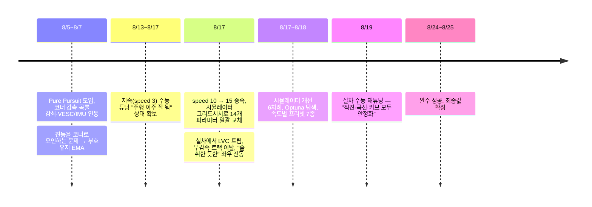

# 04. 조향 제어와 파라미터 튜닝

> 이 영역은 제가 가장 오래 붙잡고 있었던 부분입니다. Pure Pursuit 자체는 교과서적인 알고리즘이지만,
> **카메라 픽셀 경로 위에서, 지연이 있는 실제 서보로, 배터리가 버티는 가속도 안에서** 돌리려면
> 파라미터 30여 개를 맞춰야 했습니다.

## 컨트롤러 구조

차선 주행과 라바콘 구간 모두 `PurePursuitController` 하나로 조향합니다. LQR도 구현했지만 실차에서 한 번도
켜보지 않은 채 남아 있어 8/14에 삭제했습니다. Stanley와 Hybrid A*도 코드만 보존돼 있습니다.

### 조향각 계산

경로는 BEV 픽셀 좌표(1m = 200px)의 웨이포인트 목록입니다. 차량을 BEV 하단의 고정점으로 보고 픽셀
좌표계 안에서 그대로 기하 계산을 합니다.

```
목표점      = 경로 위에서 차량으로부터 호길이 ld만큼 떨어진 점
curvature  = 2·sin(α) / ld                 α: 차량 정면과 목표점 사이 각
steer      = atan(curvature · WHEELBASE_PX · boost)
steer      = α_f · steer + (1 − α_f) · steer_prev     (PP_ALPHA, 저역통과)
drive()    → 틱당 최대 12° 변화로 제한(ANGLE_RATE_MAX) 후 ±80° 클램프
```

`WHEELBASE_PX`는 이름과 달리 **튜닝 게인**입니다. 실측 축거(0.335m × 200 = 67px)로 계산한 값은 오히려
진동을 만들었고, 최종값은 30px에 조향각 비례 부스트(최대 2.75배)를 더한 형태입니다.

### 적응형 lookahead

| 요소 | 동작 | 이유 |
|---|---|---|
| 속도 비례 | `ld = base + gain·(speed − anchor)`, 상한 있음 | 빠를수록 멀리 봐야 같은 픽셀 노이즈가 덜 증폭됨 |
| 곡률 감쇠 | 코너일수록 ld를 `min` 쪽으로 당김 | 코너에서 안쪽을 덜 깎고 촘촘히 추종 |
| 감쇠 판단 기준 | 매 프레임 **고정 기준거리에서 새로 잰 곡률**(probe) 사용 | 직전 ld로 잰 곡률을 쓰면 ld↓ → 노이즈 증폭 → 곡률↑ → ld↓ 자기순환에 빠짐 (실차에서 조향각 15초 고정으로 재현) |
| IMU 교차검증 | 비전 곡률과 IMU yaw rate 곡률 중 큰 쪽 사용 | 비전이 못 본 코너를 IMU가 보완. 두 센서 모두 살아있을 때만 |

### 속도 계획

```
target = SPEED_NORMAL · (1 − STEER_GAIN · turn³)      turn: 조향각의 부호 유지 EMA
target = max(SPEED_CORNER_MIN, target · 회전반경 기반 감속비)
목표 속도까지는 틱당 SPEED_ACCEL_STEP씩만 증가
```

- **조향각 순간값이 아니라 부호 유지 EMA로 코너를 판단합니다.** 차선 중앙에서 좌우로 흔들릴 때 순간값을
  쓰면 매 스윙을 급코너로 오인해 속도가 출렁였습니다. 부호가 바뀌는 진동은 EMA에서 상쇄되고, 부호가
  유지되는 진짜 코너만 남습니다.
- **회전반경 기반 감속**은 ROS2 Nav2의 Regulated Pure Pursuit 방식입니다.
- **`SPEED_CORNER_MIN`은 모터 데드존(≈1.4)보다 충분히 커야 합니다.** 초기값 3.0에서 급커브가 이어지면
  차가 멈췄습니다.
- **`SPEED_ACCEL_STEP`은 배터리가 정합니다.** 가속을 세게 걸면 전류 스파이크로 ESC가 저전압 보호(LVC)에
  걸려 순간 정지했다가 튀어나갑니다. 시뮬레이터가 이걸 모르기 때문에 이 값만큼은 실차 기준으로 고정했습니다.

## 튜닝 과정



### 1단계: 저속 수동 튜닝

`SPEED_NORMAL=3`에서 손으로 맞춘 값이 처음으로 "주행이 아주 잘 된다"는 평가를 받았습니다. 이 값은 이후에도
`speed3` 프리셋으로 보존해 두고, 고속 튜닝이 망가질 때마다 돌아갈 기준점으로 썼습니다.

### 2단계: 속도를 올리자 무너진 것들

속도를 10, 15로 올리면서 수동 튜닝이 감당하지 못하는 조합 폭발이 생겼습니다. lookahead 상한은 속도를
따라 다시 계산해야 하고, 코너 감속 하한은 `SPEED_NORMAL`보다 낮아야 감속이 살아있고, 필터를 세게 걸면
코너 반응이 죽고 약하게 걸면 직진이 흔들렸습니다.

### 3단계: 화이트박스 시뮬레이터 `pp_tune_gridsearch.py`

실제 `PurePursuitController`와 속도 계획 코드를 **수정 없이 그대로 불러와** 가상 차량을 몰게 하는
시뮬레이터입니다.

1. 기준 경로(직진, 90도 커브, S자, 그리고 대회 도면 치수로 만든 **실전 트랙 한 바퀴**)를 차량 좌표로 변환
2. 200px/m로 픽셀화하고 세그멘테이션 노이즈(σ=1.5px)를 얹어 웨이포인트를 합성
3. 실제 코드의 경로 EMA와 디바운스를 그대로 재현 (조향 변화율 제한은 8/18 6차 개선 때 추가)
4. 실측 축거 0.335m의 자전거 모델(또는 F1TENTH Single Track 동역학 모델)로 차량을 전진
5. 횡편차(cte), 조향 잔떨림, 평균 속도, **모드 전환 구간 cte**를 가중합해 채점

탐색은 랜덤 서치 20,000샘플에서 시작해 Optuna TPE 10,000트라이얼로 이어갔고, 파라미터는 23개에서
디바운스까지 포함한 25개로 늘었습니다. 속도 10부터 25까지 2.5 간격 7개 프리셋을 뽑아
`config.py`의 `PP_TUNE_PRESETS`에 넣고 한 줄(`PP_TUNE_ACTIVE_PRESET`)로 바꿔 끼울 수 있게 했습니다.

시뮬레이터를 만들면서 시뮬레이터 자체의 버그도 잡아야 했습니다.

- **폐루프 앨리어싱.** 실전 트랙은 한 바퀴가 이어진 경로라, 공간적으로만 가까운 다른 구간의 점이
  "가장 가까운 점"으로 잡혔습니다. 출발 직후 조향이 ±45°로 폭주했고, 직전 위치 근방만 찾는 탐색창으로
  고쳤습니다. 실제 카메라가 도로 반대편을 볼 수 없는 것과 같은 제약입니다.
- **코너 감속 무력화.** `SPEED_CORNER_MIN`을 `SPEED_NORMAL`과 독립적으로 샘플링하다 보니, 하한이 순항
  속도보다 높아 감속이 아예 꺼지는 조합이 최고점을 받았습니다. 탐색 공간에 `corner_min < normal` 제약을
  추가했습니다.
- **속도 환산값 오류.** 시뮬레이터가 쓰던 `METERS_PER_SPEED_UNIT=0.1347`은 2점 측정 외삽이었습니다.
  줄자와 타이머로 speed 5/10/15를 각 3~4회 재측정해 **0.0848**로 고쳤고(원점 고정 회귀, 첫 구간 가속은
  자동 제외), 이 값으로 전부 재탐색했습니다. speed 20 이상은 견인력 포화로 비선형이라 이 상수를 쓸 수
  없다는 것도 이때 확인했습니다.

### 4단계: 시뮬레이션 최적값이 실차에서 실패한 이유

8/17 시뮬레이터 최적 `speed15` 프리셋을 실차에 올리자 세 가지가 동시에 터졌습니다.

| 증상 | 원인 | 시뮬레이터가 몰랐던 것 |
|---|---|---|
| 달리다 훅 멈췄다 튀어나감 | `SPEED_ACCEL_STEP` 1.014(검증값의 2.5배) → 배터리 LVC 트립 | 배터리·전류 |
| 좌회전 진입에서 감속 없이 트랙 이탈 | `SPEED_CORNER_MIN` 14.05 ≈ `SPEED_NORMAL` 15 → 감속 무력화 + 그 순간 경로 인식 실패 | 인식 실패 구간 |
| 직선에서 좌우로 크게 흔들림 | lookahead 시간이 2.0초 → 0.5초로 줄어 속도 × 게인이 6배 | **서보·카메라 지연, 조향 변화율 제한** |

세 번째가 가장 오래 걸렸습니다. 처음에는 경로 EMA(`PATH_EMA_ALPHA`)를 의심해 0.25에서 0.9까지 바꿔봤지만
어느 값에서도 진동이 똑같이 재현돼 EMA는 범인이 아니라고 판단했습니다. 당시에는 `WHEELBASE_PX`가 검증값의
2배(47.36)인 것을 원인으로 보고 25로 되돌렸습니다.

나중에 다시 계산해 보니, 문제는 `WHEELBASE_PX` 하나가 아니었습니다. 직진 근처 조향은
`steer ≈ WHEELBASE_PX · 2·dx / ld²`라 게인은 lookahead와 함께 정해지고, 빠를수록 같은 조향에 오차가 더 빨리
변하므로 안정성을 좌우하는 건 **속도 × 게인**, 곧 **lookahead 시간**(ld ÷ 속도)입니다.

| | 저속 수동 (안정) | 시뮬 최적 (진동) | `WHEELBASE_PX`만 25로 | 본선 |
|---|---|---|---|---|
| 속도 | 0.25 m/s | 1.27 m/s | 1.27 m/s | 1.02 m/s |
| 직진 lookahead | 0.51m | 0.64m | 0.64m | 1.10m |
| **lookahead 시간** | **2.0초** | **0.50초** | 0.50초 | **1.08초** |
| 조향 게인 (rad/m) | 0.96 | 1.16 | 0.61 | 0.25 |
| **속도 × 게인** | **0.24** | **1.48** | 0.78 | **0.25** |

<sub>1m = 200px, 속도 1단위 = 0.0848 m/s. 작은 각 근사이며, 조향각 비례 부스트와 곡률 감쇠는 뺀 직진 기준입니다.
speed 3은 속도 실측 구간(5~15) 밖이라 근사값입니다.</sub>

- 시뮬레이터는 게인 자체보다 **속도 × 게인을 6배로** 올렸습니다. 게인만 보면 저속값과 1.2배 차이였습니다.
- `WHEELBASE_PX`만 되돌린 상태는 여전히 안정값의 3배였고, "직진 약간 불안정" 기록이 8/19까지 이어졌습니다.
- 본선값은 lookahead를 1.10m로 늘려 속도 × 게인을 안정적이던 저속값과 거의 같은 0.25로 되돌렸습니다.

진동의 기전은 측정하지 못했습니다. 당시 시뮬레이터에는 서보·카메라 지연도, 조향 변화율 제한(틱당 12°)도
없었습니다. 게인이 높은 루프에서는 둘 다 진동을 만들 수 있어서, 무엇이 주원인이었는지는 구분하지 못했습니다.

최종값은 결국 **시뮬레이터 결과를 출발점으로 실차에서 손으로 맞춘 값**입니다.

### 최종값

| 파라미터 | 저속 수동 (`speed3`) | 시뮬 최적 (8/17) | **본선 (`speed15` 프리셋)** |
|---|---|---|---|
| `SPEED_NORMAL` | 3.0 | 15.0 | **12.0** |
| `SPEED_CORNER_MIN` | 5.0 | 14.05 | **10.0** |
| `SPEED_ACCEL_STEP` | 0.4 | 1.014 | **0.8** |
| `PP_WHEELBASE_PX` | 25.0 | 47.36 | **30 + 조향각 비례 부스트(0.17/°, 최대 2.75배)** |
| `PP_LOOKAHEAD_BASE_PX` | 90 | 84.2 | **220** (speed 12 기준) |
| `PP_LOOKAHEAD_MIN_PX` | 40 | 47.88 | **140** |
| `PP_LOOKAHEAD_CURVATURE_GAIN` | 100 | 214.5 | **70** |
| `PP_ALPHA` (새 값 가중치) | 0.8 | 0.48 | **0.9** |
| `PATH_EMA_ALPHA` (새 값 가중치) | 0.25 | 0.25 (탐색 대상 아님) | **0.7** |

> 프리셋 이름은 `speed15`지만 본선 순항 속도는 12입니다. 8/19 실차 재튜닝에서 "속도 12, 코너 10
> 기준으로 직진·커브·코너가 모두 잡혔다"는 결과가 나와, "직진 잘한 상태"라는 주석과 함께 그대로 확정했습니다.

최종값은 저속 수동값보다 **lookahead는 훨씬 길고 필터는 훨씬 약합니다.** lookahead를 늘려 실효 게인을 낮추면
같은 픽셀 노이즈가 조향으로 덜 증폭되므로, 지연을 만드는 필터에 기댈 필요가 줄어듭니다. 직진 근처 게인은 낮게
두고, 큰 조향이 필요한 코너에서는 조향각 비례 부스트(최대 2.75배)로 힘을 되찾는 비선형 구조입니다.

## 다음에 한다면

- 조향 파라미터를 픽셀이 아니라 **lookahead 시간**으로 정의하겠습니다. 속도를 바꿀 때 lookahead 시간이
  유지되도록 하면, 같은 효과를 내는 `WHEELBASE_PX`와 lookahead를 따로 탐색하는 중복도 사라집니다.
- 시뮬레이터에 **제어 지연 모델**(조향 명령을 N틱 늦게 반영), **조향 변화율 제한**, **가속도 상한**을 처음부터
  넣겠습니다. 이번에 실차에서 깨진 세 가지 중 두 가지가 이 모델 공백에서 나왔습니다.
- `rosbag2`로 조향 명령, VESC 속도·전압, 인식 경로를 기록해 루프 지연을 직접 재고, 시뮬레이터를 실측과
  맞추는 단계를 두겠습니다. 이번엔 카카오톡으로 공유한 휴대폰 영상을 프레임 단위로 뜯어보며 원인을 찾았습니다.
- 튜닝값마다 **실측 / 시뮬 / 수동** 출처를 표기하는 습관은 이번에 잘 지킨 부분이라 유지하겠습니다.
