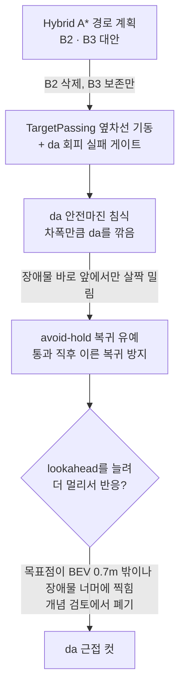

# 05. 미션별 처리

네 가지 미션 모두 공통된 흐름을 거쳤습니다. **전용 회피 로직을 정교하게 만들었다가, 결국 차선 주행에
얹는 단순한 방식으로 수렴**했습니다. 차선 주행(da 경로 + Pure Pursuit)이 가장 많이 검증된 부분이었기
때문입니다.

## 신호등 (출발 · 경로 선택)

### 최종 동작

- 출발선과 교차로 모두 같은 4구 신호등이고, 같은 상태(`S0_SIGNAL`)와 같은 모델로 처리합니다.
- YOLO 단일 모델이 `red` / `green_straight` / `green_left`를 직접 예측하고, **5프레임 연속**이면 확정합니다.
- 직진 확정 → 정지 없이 다음 바퀴 B1~B3 재무장. 좌회전 확정 → 지름길 파이프라인.
- 확정 즉시 신호등 YOLO를 꺼서 GPU를 다른 모델에 넘깁니다.

### 거쳐온 방식

| 시기 | 방식 | 결과 |
|---|---|---|
| 7월 | HSV 색 마스크 / Hough Circle | 조명·반사에 민감, 범위 완화와 디버그 창 추가로 버팀 |
| 8/18 | 흰 배경판 자동 크롭 (그레이스케일 → HSV 채도 제한) | 일부 성공. 천장 조명 오탐 → 블롭 점유율 게이트로 94% 감소 |
| 8/18 | 원 탐색 대안 FRST, Hough 파라미터 완화, 언샤프 마스킹 | 셋 다 Hough보다 못하거나 노이즈 급증으로 폐기 |
| 8/18 | 전체 랩 2,262프레임 오탐 스윕 | **사람이 디바운스를 통과하는 사례** 발견 → 종횡비 하한으로 차단 |
| 8/19~20 | 배경판 위치는 YOLO, 색은 Hough인 하이브리드 | 비교용으로 YOLO 단일 모델 병행 |
| 8/20~21 | **YOLO 단일 모델로 전환**, HSV/Hough 코드 삭제 | 본선 방식 |

하루(8/18) 동안 고전 CV로 할 수 있는 시도를 다 해본 뒤 학습 모델로 넘어간 셈입니다. 같은 날 만든
오프라인 재검증 도구(녹화 프레임에 알고리즘을 돌려 오탐/미탐을 세는 스크립트)가 판단 근거가 됐습니다.

### 디바운스 딜레마

`green_left`는 `green_straight`보다 평균 신뢰도가 낮고, 한 프레임만 보면 둘이 동시에 뜨기도 했습니다.
몇 초 연속으로 보면 안정됐습니다. 확정 프레임 수(`SIG_CONFIRM_FRAMES`)는 하루 사이에
**1 → 3 → 10 → 200 → 100 → 10**을 오갔고, 본선에서는 5였습니다.

- 너무 작으면 직진 오검출 한 프레임에 Phase가 넘어가 좌회전 기회를 놓칩니다.
- 너무 크면 연속 카운트라 한 프레임만 끊겨도 처음부터 다시 셉니다.

이 디버깅 세션에서 남긴 교훈은 "**증상과 원인이 어긋나 있었다**"는 것입니다. "YOLO 창에는 좌회전이
떴는데 확정이 안 된다"는 보고의 상당수는, 상태 전환 순간 카운터가 리셋되면서 생긴 **디버그 표시의
착시**였습니다. FSM은 이미 반응한 뒤였습니다.

## B1 라바콘

### 최종 동작

1. **진입**: 라이다 좌우 클러스터 AND YOLO 콘(면적 게이트 + 5프레임)
2. **킥**: 진입 순간 고정 조향 −30°를 0.4초 걸어 확실히 꺾음
3. **통과**: 일반 차선 주행과 같은 da 경로를 따라가되, 라이다로 본 콘이 안전마진(좌 0.35m / 우 0.23m, 코드상 값)
   안으로 들어오면 그만큼 경로를 반대쪽으로 밀어줌. 라바콘 전용 Pure Pursuit 파라미터 세트 사용
4. **탈출**: 넓은 ROI에서 좌우 모두 약 2초간 비면 장애물 구간으로

### 경로 생성 방식의 변천

| 날짜 | 방식 | 버린 이유 |
|---|---|---|
| ~8/19 | 콘 점 전체로 **보로노이** 다이어그램, 정점을 중심선으로 | 구조가 차선 주행과 달라 별도 튜닝 필요 |
| 8/19 | 좌우 콘 클러스터를 같은 순번끼리 짝지어 중점 | 급커브에서 i번째 좌·우 콘이 물리적으로 가깝다는 보장 없음 |
| 8/19 | 유클리드 최근접 이웃 짝짓기 | 서로 다른 경계의 콘(내 차로 안쪽 + 그 너머)이 짝지어질 위험 |
| 8/19 | 전방으로 0.2m 박스를 쌓고 **박스 안에서만** 좌우 1점씩 | 구조적으로 잘못된 짝짓기 불가. 하지만… |
| 8/20 | **회피 조향을 끄고 진입/탈출 트리거만** 남김 | da가 콘을 주행불가 영역으로 잘 잡아줘 차선 주행만으로 대부분 통과 |
| 8/21 | 차선 주행 위에 **라이다 push 안전판**만 추가 | 본선 방식 |

하루에 네 번 알고리즘을 바꾼 끝에, 가장 단순한 방식이 이겼습니다. 세그멘테이션 모델이 콘을 이미 "도로가
아닌 것"으로 보고 있었기 때문입니다.

## B2 고정장애물 · B3 방해차량

### 최종 동작: da 근접 컷

별도 회피 상태로 들어가지 않습니다. 라이다(B2는 전방 1.0m·좌우 0.55m, 움직이는 B3는 전방 2.5m·좌우 0.75m ROI)와 YOLO가 동시에 장애물을 잡으면,
**차량과 장애물 사이 구간에서 장애물 쪽 절반의 da를 잘라냅니다.** 그러면 da가 갈림길처럼 보이고, Pure
Pursuit은 평소 코너를 돌듯 자연스럽게 반대편으로 조향합니다.

> 라이다 관련 거리값(m)은 코드상 값입니다. 본선 코드의 라이다 각도 변환 버그 때문에 실제 거리는 적힌 값의 약 0.7~0.8배입니다 ([03-perception.md](03-perception.md#라이다에서-끝내-못-푼-것)).

- 장애물 근처에서는 미리 속도를 8로 제한합니다(`SPEED_PRE_OBSTACLE_CAP`).
- 진입 순간 1초간 lookahead 곡률 감쇠 게인을 올려 더 촘촘하게 추종합니다.
- 카메라에서 장애물이 사라져도 바로 해제하지 않습니다. 카메라가 차량 앞코에 있어서, 장애물을 지나치는
  순간 시야에서 사라지지만 차체는 아직 옆에 있기 때문입니다.

### 근접 컷에 도달하기까지



lookahead 확장안을 버린 이유는 이렇습니다. da 안전마진이 만드는 경로는 장애물 근처에서만 옆으로 밀렸다가 지나면
다시 중앙으로 돌아오는 모양이고, BEV에 보이는 범위도 0.7m뿐입니다. lookahead를 늘리면 목표점이 그 범위를 넘거나
장애물 너머 이미 중앙으로 돌아온 구간에 찍혀, 오히려 회피 조향이 약해집니다. 또 경로가 한 번 계단처럼 밀린
모양이라면, 곡률 ≈ 2·dx/ld²이므로 ld가 커질수록 같은 횡편차의 곡률이 희석됩니다. 둘 다 경로 모양에 대한 전제가
있을 때 성립하는 논증입니다.

물리적 여유도 계산했습니다. 필요한 횡이동(차폭 절반 + 장애물 반폭 + 여유 ≈ 0.3m)을 축거 0.335m의 원호로
풀면 조향 20° 후반~30°가 필요하고, 이게 겨우 da가 보여주는 0.7m 안에 들어옵니다. 거리를 늘릴 수 없으니
속도를 줄여 시간을 버는 사전 속도 제한이 그래서 들어갔습니다.

### B2와 B3 구분

두 장애물 모두 라이다로는 비슷하게 보입니다. 처음엔 라이다 실측 폭으로 정적/동적을 구분하는 별도 Phase를
뒀다가 하나의 `OBSTACLE_ZONE`으로 합쳤고, 대신 **트랙 순서**를 이용합니다.

- 트랙 순서는 B2 → B3. B2 통과 후 3초 동안은 무엇이 잡혀도 B2로 취급합니다.
- 이 순서 가정은 8/21에 "B3 먼저"로 뒤집었다가 8/22에 실제 트랙과 맞지 않아 다시 원복했습니다.
  **전제가 틀리면 오분류 가드가 반대로 작동**하므로, 대회 당일 배치를 반드시 확인해야 하는 항목입니다.
- 방해차량 YOLO는 COCO `car`에서 대회 차량 전용 1클래스 모델로 교체했습니다(→ [03-perception.md](03-perception.md#yolo)).

## 지름길 (좌회전)

### 최종 동작

```
좌회전 확정 → 정상 주행하며 거리 누적(커밋 구간)
  → 라이다로 체크무늬 게이트 기둥쌍 검출 (5초 안에 못 찾으면 좌회전 포기, 직진 처리)
  → 진입 램프: 0° → −25°를 2.5m에 걸쳐 smoothstep 곡선으로
  → 곧장 차선 주행 복귀 (B1 재무장)
  → 램프 완료 후 5.5m 지점에서 −20° 킥 0.5초 (T자 교차로 탈출)
```

### 거쳐온 방식

| 날짜 | 진입 트리거 | 회전 방식 | 문제 |
|---|---|---|---|
| ~8/18 | 정지선 | 시간 기반 커밋 + 프레임 수로 종료 | 속도에 따라 위치가 달라짐 |
| 8/18 | 정지선 | 거리 기반 커밋 + IMU yaw로 종료 | IMU yaw 부호 규약 미검증, 튜닝도 어려워 이틀 만에 거리 기반으로 복귀 |
| 8/20 | **신호등 인식** | 실측 거리 기반 오픈루프 90° | 오픈루프 오차 |
| 8/21 | 신호등 인식 | −30° / 5cm 짧은 넛지 실험 | |
| 8/21 | 체크무늬 게이트 / 노란 점선 카운터 후보 비교 | | 점선 카운터는 나무 바닥 오검출 → 연결요소 기준으로 수정 |
| 8/21~22 | **라이다 기둥쌍** | **완만한 램프 (smoothstep)** | 본선 방식 |
| 8/24 | | T자 출구 강제 좌회전 킥 추가 | 차선 인식만으로는 T자에서 방향을 못 정함 |

T자 출구 킥이 필요했던 이유가 흥미롭습니다. 반시계 트랙이라 출구에서는 **항상** 좌회전해야 하지만,
차선 인식은 그 규칙을 모르고 양쪽 다 도로로 봅니다. 규칙으로 알 수 있는 건 규칙으로 처리했습니다.

처음에는 출구 킥이 입구 램프 코드를 재사용했는데, 행동 FSM이 킥 조향을 덮어쓸 수 있는 구멍이 있어 킥
동안에는 FSM 게이트를 통째로 끄는 독립 로직으로 분리했습니다.
