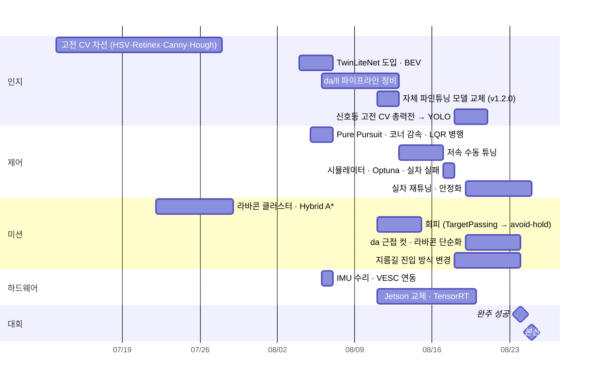

# 09. 타임라인

팀 저장소 커밋 332개와 설계 일지를 날짜순으로 묶었습니다.

## 7월: 뼈대와 고전 CV

| 날짜 | 내용 |
|---|---|
| 7/4 | 저장소 생성. 예선 코드(`track_drive.py` 단일 파일) 기반 |
| 7/8 | 타 팀 공개 코드 3종(2024 포스카, 2024 코봇, 2023 AuTURBO) 분석 — 알고리즘 수준은 비슷하고 **튜닝·테스트 반복량이 승부처**라는 결론 |
| 7/13~7/24 | 차선 인식 고전 CV 시도: 빛 반사 3차 수정, Top-Hat, Canny, Retinex(MSR), Adaptive Threshold |
| 7/15~7/22 | 팀원 리팩토링 후 import 크래시(ROS1 `rospy` 잔존 등) 정리, 라이다 각도 실측, 라바콘 클러스터 검출 |
| 7/21~7/22 | 본선 설계 문서화: LiDAR SLAM 대신 카메라 랜드마크 + 휠 오도메트리, 오프라인 레이싱라인 구상 |
| 7/29 | Hybrid A* 장애물 회피 적용 |

## 8월 1~2주: 딥러닝 전환과 제어기 정착

| 날짜 | 내용 |
|---|---|
| 8/4 | **TwinLiteNet 기반 차선 인식 도입**, 차량·도로 치수 실측 |
| 8/5 | BEV, Pure Pursuit(능동 lookahead, Nav2식 코너 감속), 인지 모듈 폴더 정리, `config.py` 신설 |
| 8/6 | da 면적 상한·차선책, VESC 실측 속도(ROS1 브릿지), IMU 수리·편입, lookahead 자기순환 락업 수정 |
| 8/7 | da 덩어리 선택을 시드·연속성 기준으로, ll 흰선/노란선 분리, 가속 램프 완화(LVC) |
| 8/10 | ll 알고리즘 두 갈래 병합(A/B 스위치), 코너 감속 EMA 롤백 사고 및 복구 |
| 8/11 | Jetson 세팅 체크리스트, 자체 파인튜닝 모델 교체, 라바콘 YOLO 이중확인, B2/B3 실차 테스트 시작 |
| 8/12~8/13 | 1,068장 → 3,446장 모델, S자 커브 안정화 |
| 8/14 | **TensorRT 이슈**(콘 모델 8분 블로킹, TwinLiteNet 엔진 캐시), LQR 삭제, avoid-hold |

## 8월 3주: 속도를 올리며 무너지고 다시 세움

| 날짜 | 내용 |
|---|---|
| 8/15 | B2/B3 Phase 통합 |
| 8/17 | **중대 버그 연속**: 조향 기준점 좌편향(평균 24°), 회피 중 경로 점프 → 벽 충돌, 시뮬 프리셋의 LVC 트립·무감속 이탈·좌우 진동. 설계 일지 1차 압축(2,924줄 → 618줄) |
| 8/18 | 속도 실측 재보정(0.1347 → 0.0848), Optuna 프리셋 7종, "속도 5 고정" 원인 제거, 신호등 고전 CV 총력전 |
| 8/19 | 실차 수동 재튜닝 "직진·곡선·커브 모두 안정화", 2바퀴 주행 성공, 라바콘 알고리즘 4회 교체 |
| 8/20 | 신호등 YOLO 단독 전환, 상태 통합(`S0_SIGNAL`), YOLO 단계별 가동, **da 근접 컷**, 방해차량 전용 모델 |
| 8/21 | 지름길: 라이다 기둥쌍 + 완만한 램프, 커스텀 NMS export(v1.2.0), 라바콘 push 안전판 |
| 8/22~8/23 | B2/B3 순서 반전과 원복, 좌회전 데이터 103장 추가 학습, YOLO 면적 게이트 |

## 대회 주간

| 날짜 | 내용 |
|---|---|
| 8/24 | B1/B2/B3 면적 임계값 실측 확정, 5프레임 디바운스, **완주 성공**, 지름길 T자 출구 킥 |
| 8/25 | 좌회전 진입·탈출 안정화, 디버그 창 전부 끔, **본선** |
| 8/31 | 팀 저장소 정리: 대문 README, 가중치 분리, 주석에서 날짜별 이력 제거, 설계 일지 447줄로 압축 |
