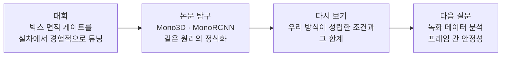

# 11. 카메라 기반 거리 추정: 대회에서 논문으로

> 대회에서는 YOLO 박스 크기로 "충분히 가까운지"를 판정했습니다. 대회가 끝난 뒤 단안 카메라 3D 검출 논문들을
> 공부하면서, 이 방법이 어떤 기하 원리 위에 서 있었는지와 우리 환경에서 어디까지 유효했는지를 정리했습니다.



---

## 1. 대회에서 한 것

### 문제

YOLO는 화면에 물체가 보이기만 하면 검출합니다. 그런데 장애물 회피나 라바콘 진입은 **물체가 일정 거리 안에
들어왔을 때** 시작해야 합니다. 멀리 있는 콘이나 차량이 작게 찍혔을 때 반응하면, 회피 컷이나 진입 킥이 엉뚱한
위치에서 발동합니다.

### 방법: 박스 면적을 거리 대신 쓰기

이번 프레임 검출된 박스 중 **가장 큰 박스의 면적**이 임계값 이상일 때만 검출로 인정했습니다. 이 조건을 기존
라이다 ROI 조건과 **AND**로 묶었고, 한 프레임짜리 오검출을 막기 위해 **5프레임 연속**(약 0.25초)으로 통과해야
확정하도록 했습니다.

| 대상 | 검출기 | 면적 하한 (640 입력 기준) |
|---|---|---|
| B1 라바콘 진입 | 콘 모델 | 5,000px² |
| B2 고정장애물 | 콘 모델 (B1과 공용) | 2,500px² |
| B3 방해차량 | 방해차량 전용 모델 | 4,500px² |
| 신호등 | 신호등 모델 | 1,500px² |

임계값은 미션마다 박스 면적을 실시간으로 보여주는 전용 디버그 창을 띄우고, **반응해야 할 거리에 물체를 두고
박스 크기를 직접 재서** 정했습니다. 같은 콘 검출기를 쓰는 B1과 B2도 상황(진입 판정인지, 이미 회피 구간을
지나는 중인지)이 달라 임계값을 따로 뒀습니다.

---

## 2. 왜 통했나: 핀홀 카메라의 크기-거리 관계

핀홀 카메라에서 물체의 이미지상 높이 `h`와 실제 거리 `Z` 사이에는 이런 관계가 있습니다.

```
h = f · H / Z        f: 초점거리(px), H: 물체의 실제 높이(m)
→ Z = f · H / h
→ 박스 면적 ∝ 1 / Z²
```

물체의 실제 크기가 정해져 있으면, **박스 면적 임계값은 곧 거리 임계값**입니다. 같은 물체라면 면적이 절반으로
줄 때 거리는 약 1.41배(√2) 멀어집니다.

우리 대회는 이 관계가 특히 잘 맞는 환경이었습니다.
- **물체 종류가 사실상 고정**이었습니다. 콘은 같은 규격이고, 방해차량은 대회에서 쓰는 단 한 대였습니다.
- **판정만 하면 됐습니다.** 거리를 연속값으로 정확히 맞힐 필요 없이, "지금 반응할지"만 정하면 됐습니다.
- **임계값을 실차에서 직접 쟀습니다.** 카메라 내부 파라미터를 모르고, 렌즈 왜곡이 커도 그 효과가 측정값에
  흡수됐습니다.

---

## 3. 논문에서 찾은 같은 원리

### Mono3D: 지면 가정 (CVPR 2016)

단안 카메라만으로 3D 박스를 찾기 위해, **물체는 지면 위에 놓여 있다**는 가정으로 3D 후보를 만들고, 이를
이미지에 투영해 세그멘테이션·형태·크기·위치 사전정보로 점수를 매깁니다.

### MonoRCNN: 거리 분해 (ICCV 2021)

거리를 하나의 숫자로 직접 회귀하지 않고, 위 핀홀 식처럼 **물체의 실제 높이와 이미지상 투영 높이로 분해**해서
각각 예측합니다. 두 높이가 서로 맞물리도록 예측하면 각각이 다소 부정확해도 거리는 안정적으로 나오고, 거리
불확실성이 어디서 오는지 추적할 수도 있습니다.

### 우리 방식과의 관계

정리하면, 대회에서 한 것은 **MonoRCNN이 학습 기반으로 정식화한 원리를, 물체 크기가 고정인 특수한 경우로
경험적으로 쓴 것**입니다. 같은 방법을 구현한 것은 아니고, 차이는 이렇습니다.

| | 우리 대회 코드 | MonoRCNN |
|---|---|---|
| 하는 일 | 거리 **임계값 판정** | 거리 **연속값 추정** |
| 물체 실제 크기 | 사실상 고정 | 물체마다 달라 따로 회귀 |
| 이미지 단서 | 박스 **면적** | 박스 **높이** |
| 카메라 모델 | 내부 파라미터 없이 실측 임계값 | 카메라 내부 파라미터 사용 |
| 렌즈 | 170° 어안 | 일반 핀홀 카메라 |
| 센서 | 라이다와 AND 조건 | 카메라 단독 |

---

## 4. 다시 보니 보이는 한계

| 한계 | 왜 문제인가 |
|---|---|
| **면적은 가림·잘림에 약합니다** | 콘이 다른 콘에 가리거나 화면 가장자리에 잘리면 면적이 급격히 줄어듭니다. 높이는 가로 방향 잘림에 덜 민감합니다. 차량은 보는 각도에 따라 폭이 달라져 면적도 같이 변합니다. |
| **어안 렌즈는 핀홀 식을 깨뜨립니다** | 170° 렌즈에서는 같은 거리의 물체도 화면 가운데와 가장자리에서 박스 크기가 다릅니다. 임계값은 측정할 때의 화면 위치에서만 정확합니다. |
| **임계값은 한 지점만 압니다** | "이 거리에서 면적 5,000"이라는 한 점만 맞췄기 때문에, 다른 거리에서의 추정에는 쓸 수 없습니다. |
| **카메라 장착에 묶여 있습니다** | 카메라 높이·각도가 바뀌면 같은 거리의 박스 크기가 달라져 모두 다시 재야 합니다. |

### 우리 환경에 더 맞았을 수 있는 방법

Mono3D식 **지면 가정**입니다. 트랙 바닥은 평평하고, 차선 인식용 BEV 변환(호모그래피)을 이미 실측해 두었습니다.
**박스 아래쪽 중심점을 BEV로 변환하면** 물체가 바닥에 닿은 지점의 위치가 바로 미터 단위로 나옵니다.

- 장점: 물체 크기나 가림에 덜 민감하고, 거리뿐 아니라 좌우 위치까지 얻습니다.
- 주의할 점: BEV 변환이 어안 왜곡을 보정하지 않은 원본 영상 위에서 정의돼 있어 멀리 갈수록 정확도가
  떨어지고, 박스 아래쪽 경계가 바닥 접점과 정확히 일치한다는 가정이 필요합니다.

대회에서는 이 방법을 쓰지 않았습니다. 같은 문제를 푸는 다른 기하 단서가 이미 손에 있었다는 것을 논문을
읽고 나서야 알았습니다.

---

## 5. 녹화 데이터로 확인할 것

추가 실차 실험은 할 수 없지만, YOLO 검출과 라이다가 함께 기록된 대회 기간 녹화 자료로 아래를 확인할 계획입니다.
라이다는 각도 변환에 버그가 있지만 **거리값 자체는 정확**해서, 정면 물체의 기준 거리로 쓸 수 있습니다
([03-perception.md](03-perception.md#라이다에서-끝내-못-푼-것)).

| 확인할 것 | 방법 | 기대하는 답 |
|---|---|---|
| 임계값이 실제 몇 m였나 | 면적이 임계값을 넘는 순간의 라이다 거리 | B1/B2/B3/신호등 게이트의 실제 발동 거리 |
| 면적이 1/Z²를 따르나 | 면적과 라이다 거리를 같이 그려 회귀 | 핀홀 관계가 어안 렌즈에서도 근사적으로 성립하는지 |
| 면적과 높이 중 무엇이 나은가 | 같은 데이터에서 `1/√면적`과 `1/높이`로 각각 거리 추정 | 가림·잘림 구간에서 어느 쪽 오차가 작은지 |
| 화면 위치의 영향 | 박스 중심의 가로 위치별 오차 | 어안 왜곡이 가장자리에서 얼마나 커지는지 |
| 지면 가정은 어떤가 | 박스 아래쪽 중심을 BEV로 변환한 거리와 비교 | 우리 환경에서 크기 단서보다 나은지 |
| 프레임 간 안정성 | 같은 물체를 따라가며 추정 거리의 흔들림 | 5프레임 디바운스가 필요했던 이유의 정량화 |

> 분석 결과는 녹화 자료를 정리한 뒤 이 절에 추가합니다.

---

## 6. 다음 질문

마지막 항목인 **프레임 간 안정성**은 단순한 구현 문제가 아니라 연구 주제로 이어집니다. 대회에서는 한 프레임짜리
오검출이 회피를 엉뚱하게 발동시킬까 봐 5프레임 디바운스를 걸었고, 신호등에서는 좌회전 신호 신뢰도가 프레임마다
흔들려 확정 프레임 수를 하루에 몇 번씩 바꿨습니다([05-missions.md](05-missions.md#디바운스-딜레마)).

이후 공부한 *Towards Stable 3D Object Detection*(ECCV 2024)은 3D 검출의 정확도와 별개로 **같은 물체에 대한 예측이
프레임 사이에서 얼마나 안정적인지**를 재는 지표를 제안합니다. 대회에서 디바운스로 덮었던 문제를, 모델 쪽에서
측정하고 개선하는 방향이 있다는 것을 알게 됐습니다. 특히 Jetson에 올리기 위해 경량화한 모델에서 이 안정성이
어떻게 달라지는지가 다음으로 파고들고 싶은 질문입니다.

---

## 참고 문헌

- X. Chen, K. Kundu, Z. Zhang, H. Ma, S. Fidler, R. Urtasun. *Monocular 3D Object Detection for Autonomous Driving.*
  CVPR 2016. [링크](https://openaccess.thecvf.com/content_cvpr_2016/html/Chen_Monocular_3D_Object_CVPR_2016_paper.html)
- X. Shi, Q. Ye, X. Chen, C. Chen, Z. Chen, T.-K. Kim. *Geometry-based Distance Decomposition for Monocular 3D Object
  Detection* (MonoRCNN). ICCV 2021. [arXiv:2104.03775](https://arxiv.org/abs/2104.03775)
- *Towards Stable 3D Object Detection.* ECCV 2024. [arXiv:2407.04305](https://arxiv.org/abs/2407.04305)
